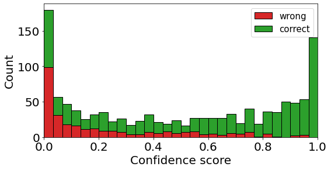
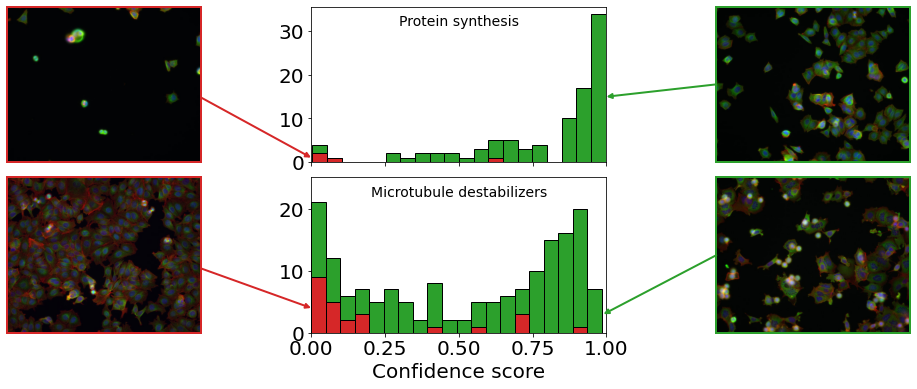

 

# Bayesian Neural Networks for Cellular Image Classification and Uncertainty Analysis
 Code to reproduce the results and figures from the corresponding [preprint](https://www.biorxiv.org/content/10.1101/824862v2.full.pdf):
 > Deodato, G., Ball, C., & Zhang, X. (2020). Bayesian neural networks for cellular image classification and uncertainty analysis. bioRxiv, 824862.

In order to implement Bayesian neural networks and use the BBBC021 dataset I used the [vinn](https://github.com/giacomodeodato/vinn) and [pybbbc](https://github.com/giacomodeodato/pybbbc) packages.

  

## Abstract

Over the last decades, deep learning models have rapidly gained popularity for their ability to achieve state-of-the-art performances in different inference settings. Novel domains of application define a new set of requirements that transcend accurate predictions and depend on uncertainty measures. The aims of this study are to implement Bayesian neural networks and use the corresponding uncertainty estimates to improve predictions and perform dataset analysis. 
We identify two main advantages in modeling the predictive uncertainty of deep neural networks performing classification tasks. The first is the possibility to discard highly uncertain predictions to increase model accuracy. The second is the identification of unfamiliar patterns in the data that correspond to outliers in the model representation of the training data distribution. Such outliers can be further characterized as either corrupted observations or data belonging to different domains.
Both advantages are well demonstrated on benchmark datasets. Furthermore we apply the Bayesian approach to a biomedical imaging dataset where cancer cells are treated with diverse drugs, and show how one can increase classification accuracy and identify noise in the ground truth labels with uncertainty analysis.
